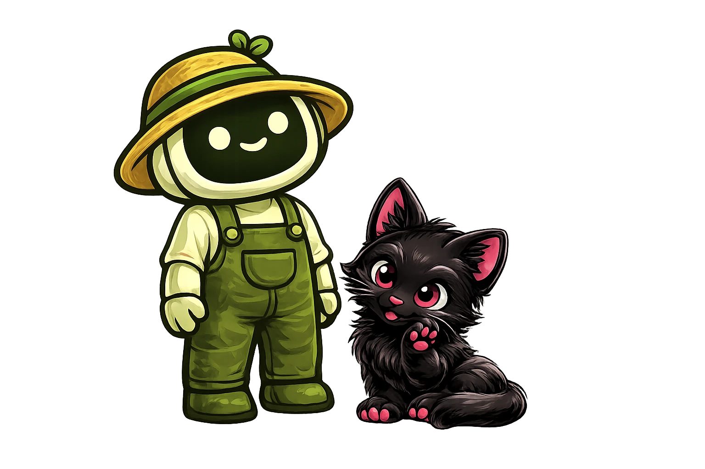

<p align="center">
  
</p>

<p align="center">
  <strong>A self-hosted AI workbench that builds tools for you.</strong><br>
  Tell it what you need and it creates a working service. Runs on your machine, powered by OpenRouter.
</p>

<p align="center">
  <a href="#installation"></a>
  <a href="#desktop-app"></a>
  <a href="LICENSE"></a>
</p>

<p align="center">
  <a href="https://openpaw.wynter.ai">Website</a>&nbsp;&nbsp;&bull;&nbsp;&nbsp;<a href="#installation">Installation</a>&nbsp;&nbsp;&bull;&nbsp;&nbsp;<a href="#getting-started">Getting Started</a>&nbsp;&nbsp;&bull;&nbsp;&nbsp;<a href="#desktop-app">Desktop App</a>&nbsp;&nbsp;&bull;&nbsp;&nbsp;<a href="#api">API</a>&nbsp;&nbsp;&bull;&nbsp;&nbsp;<a href="#just-commands">Commands</a>&nbsp;&nbsp;&bull;&nbsp;&nbsp;<a href="#contributing">Contributing</a>
</p>

---

OpenPaw is a single app you run on your computer. You chat with AI agents, describe what you want — a Slack bot, a weather checker, a scheduled report — and they build it for you as a real, running service. Pick from 39 pre-built tools or let agents create something custom. Schedule tasks, build dashboards, automate browsers, all through conversation.

The app and everything it builds runs locally. AI chat is handled through [OpenRouter](https://openrouter.ai/) (bring your own API key).

---

## Installation

The fastest way to get started — no build tools required:

```bash
mkdir openpaw && cd openpaw
npx @openpaw-ai/openpaw
```

Open **http://localhost:41295** in your browser. Requires **Node.js 18+** and an **OpenRouter API key** ([openrouter.ai](https://openrouter.ai/)).

### Desktop App

Download the native desktop app for macOS, Windows, or Linux from [GitHub Releases](https://github.com/WynterJones/OpenPaw/releases/). Built with Tauri v2.

### From Source

For developers who want to build from source (requires Go 1.25+, Node.js 18+, [just](https://github.com/casey/just#installation), and CGO):

```bash
git clone https://github.com/WynterJones/OpenPaw.git
cd OpenPaw
just frontend-install   # one-time: install npm dependencies
just run                # builds frontend + Go binary, then starts the server
```

Optionally, run `just awesome` before shipping to execute the full quality gate (tidy, vet, lint, test, build, dead code scan).

### Environment Variables (Optional)

| Variable | Default | Description |
|----------|---------|-------------|
| `OPENPAW_PORT` | `41295` | HTTP port |
| `OPENPAW_BIND` | `127.0.0.1` | Bind address (set to `0.0.0.0` for network access) |
| `OPENPAW_DATA_DIR` | `./data` (relative to binary) | Where the database and state live |
| `OPENPAW_JWT_SECRET` | auto-generated and persisted | Secret for session tokens |
| `OPENPAW_ENCRYPTION_KEY` | auto-generated and persisted | Key for encrypting secrets at rest |
| `OPENPAW_LOG_LEVEL` | `info` | Log level: debug, info, warn, error |
| `OPENPAW_DEV` | `false` | Enable development mode |
| `OPENPAW_NO_OPEN` | unset | Set to `1` to prevent auto-opening browser on startup |
| `OPENROUTER_API_KEY` | — | OpenRouter API key for AI agents (can also be set in Settings) |

## Getting Started

<p>
  
</p>

On first launch, OpenPaw shows an onboarding wizard:

- **Step 1** — Welcome overview
- **Step 2** — Create your admin account (username + password)
- **Step 3** — Configure server basics (app name, bind address, port)

After setup, you're redirected to log in. On your first conversation, the gateway agent ("Pounce") will introduce itself and ask about your preferences to personalize its personality.

<p>
  
</p>

The **Chat** page is your main interface. Create threads and converse with AI agents:

- *"Build me a weather tool"*
- *"Create a sales dashboard"*
- *"Set up a Slack integration"*

The **Gateway Agent** (Haiku by default) analyzes your request and decides the best action: route to a specialist agent, build a tool or dashboard, create a new agent, or respond directly. You'll see real-time streaming as agents work, including tool calls and progress updates.

Chat features include:
- **Threaded conversations** with automatic titles
- **@mentions** to direct messages to specific agents (`@agent-name`)
- **Work orders** for tool and dashboard builds with confirm/reject workflow
- **Multi-agent threads** with automatic routing and member tracking
- **File attachments** for sharing context with agents
- **Thread compaction** to summarize long conversations
- **Stop button** to halt an agent mid-response

<p>
  
</p>

The **Agents** page lets you create and configure specialist AI agents:

- Create custom agents with unique personalities, expertise areas, and models
- Each agent has an **identity file system** with editable files:
  - `SOUL.md` — personality and core identity
  - `USER.md` — what the agent knows about you
  - `AGENTS.md` — operating procedures and runbook
  - `BOOT.md` — startup instructions
- Assign **tools** to agents (grant/revoke access to specific tools)
- Assign **skills** from the global skill library
- Configure the **Gateway Agent** separately with its own identity files
- Agents remember context across conversations via a **per-agent memory database**

<p>
  
</p>

The **Skills** page manages reusable skill definitions:

- Create global skills as structured markdown documents with YAML frontmatter
- Install skills to individual agents from the global library
- Agents can publish their skills back to the global library
- Skills appear in agent system prompts as available capabilities
- Browse and install from **[Skills.sh](https://skills.sh)** — Vercel's open agent skills directory with 70k+ community skills — directly from the Library page

<p>
  
</p>

The **Tools** page shows everything that's been built:

- View tool status (Running, Stopped, Building, Error)
- See the manifest, available endpoints, and logs
- Start, stop, restart, compile, enable, or disable tools
- Tools run as independent Go HTTP services on auto-assigned ports
- Each tool has a health endpoint and auto-restarts on failure
- Custom widget rendering for tool output (metric cards, data tables, charts, key-value displays)

When you ask for a new tool, OpenPaw:
1. Creates a work order describing what to build
2. Scaffolds a Go HTTP service with Chi router, health endpoint, and helpers
3. Spawns a builder agent to implement the logic
4. Compiles, starts, and health-checks the tool automatically

<p>
  
</p>

The **Tool Library** provides pre-built tools that can be installed with one click:

- Browse a catalog of ready-made tools
- Install from the catalog — the tool is scaffolded and compiled automatically
- Export tools for sharing and import tools from other installations
- Integrity checking for installed tools

<p>
  
</p>

The **Secrets** page manages API keys, tokens, and credentials:

- Add secrets with a name and value
- Rotate or delete secrets
- Test connectivity

Secret values are encrypted with AES-256-GCM at rest and **never displayed again** after saving.

<p>
  
</p>

The **Scheduler** page lets you automate tasks:

- Pick from presets (hourly, daily at 9am, weekly) or write custom cron expressions
- Schedule types: tool calls, agent prompts, and browser tasks
- Route results to dashboards or notifications
- Run any schedule on-demand with the **Run Now** button
- Toggle schedules on/off and view execution history
- Automatic data retention management

<p>
  
</p>

The **Dashboards** page displays data from your tools:

- **Standard dashboards** use a widget grid system with built-in widget types:
  - Charts: line, bar, area, pie
  - Display: metric cards, status cards, data tables, key-value, text blocks, progress bars
- **Custom dashboards** are full HTML/JS/CSS applications built by agents:
  - Use any npm library via esm.sh (Chart.js, D3, Three.js, Mapbox, etc.)
  - Built-in SDK (`OpenPaw.callTool()`, `OpenPaw.getTools()`, `OpenPaw.refresh()`)
  - Auto-inherit app theming via CSS custom properties
- Dashboards support auto-refresh, manual refresh, and live tool data sources

<p>
  
</p>

The **Context** page is a file manager for reference documents:

- Organize files in a folder tree structure
- Upload documents (up to 10MB) for agents to reference
- "About You" section for personal context that agents can access
- Supported files are injected into agent context for informed responses

<p>
  
</p>

The **Browser** page provides headless browser sessions powered by [go-rod](https://github.com/go-rod/rod):

- Create named browser sessions with persistent user data directories
- Agents can navigate, click, type, extract data, and take screenshots
- **Human takeover** — take manual control of a session (e.g., to log in) and release back to the agent
- View live screenshots of active sessions
- Track browser tasks with full action history
- Schedule browser automation tasks via the scheduler

<p>
  
</p>

The **Heartbeat** page runs periodic AI-powered system health checks:

- Configurable interval (default: hourly)
- Active hours window (e.g., 9 AM to 10 PM) with timezone support
- The gateway agent reviews system state and agent HEARTBEAT.md files
- Results are broadcast in real-time and stored in execution history
- Enable/disable and trigger manual runs

<p>
  
</p>

A **notification system** keeps you informed of important events:

- Agents and system processes can create notifications with priority levels
- Real-time delivery via WebSocket
- Mark as read, dismiss individual notifications, or dismiss all
- Unread count badge in the UI

<p>
  
</p>

Under **Settings > Design**, you can customize the look and feel of the UI:

- Accent color (all UI colors generated automatically)
- Font family
- Background image (none, presets, or upload your own)

Changes are applied instantly via CSS variables. You can also ask agents in chat to restyle things — they have API access to update the design config.

<p>
  
</p>

The **Settings** page provides system configuration:

- **Design** — full theme customization (see above)
- **Models** — configure gateway model, builder model, max turns, and agent timeout
- **API Key** — set or update your OpenRouter API key (encrypted at rest)
- **Available Models** — browse models available through OpenRouter
- **System** — view system info, check API balance, delete all data

<p>
  
</p>

The **Logs** page shows a full audit trail:

- Tool created/updated/deleted
- Agent spawned/completed/failed
- Secrets changed
- Schedules modified
- Actions invoked
- Log statistics and per-tool log viewing
- Filter by action type, date range, or target

## Accessing from Other Devices

By default, OpenPaw binds to `127.0.0.1:41295` (localhost only). To access from other devices on your network, set `OPENPAW_BIND=0.0.0.0` and visit `http://<your-ip>:41295` from a phone, tablet, or another computer.

Authentication is required — there's no anonymous access. The UI is fully responsive with a mobile-optimized bottom navigation bar.

<a id="api"></a>
<p>
  
</p>

All endpoints live under `/api/v1/`. Authentication uses JWT tokens stored in HttpOnly cookies (`openpaw_token`), with CSRF protection via the `X-CSRF-Token` header for mutating requests.

### Public Endpoints

| Method | Endpoint | Description |
|--------|----------|-------------|
| POST | `/api/v1/auth/login` | Log in (rate limited) |
| GET | `/api/v1/setup/status` | Check if setup is needed |
| POST | `/api/v1/setup/init` | Complete initial setup |
| POST | `/api/v1/setup/agent-roles` | Seed agent role presets during setup |
| GET | `/api/v1/settings/design` | Get design config (needed for theming before login) |
| GET | `/api/v1/system/prerequisites` | Check system prerequisites |
| GET | `/api/v1/system/health` | Health check |
| GET | `/api/v1/uploads/avatars/{filename}` | Serve uploaded avatars |
| GET | `/api/v1/ws` | WebSocket connection (auth handled internally) |

### Protected Endpoints

#### Auth
| Method | Endpoint | Description |
|--------|----------|-------------|
| POST | `/api/v1/auth/logout` | Log out |
| POST | `/api/v1/auth/change-password` | Change password |
| DELETE | `/api/v1/auth/account` | Delete account |
| GET | `/api/v1/auth/me` | Get current user info |
| PUT | `/api/v1/auth/profile` | Update user profile |
| POST | `/api/v1/auth/avatar` | Upload user avatar |

#### Tools
| Method | Endpoint | Description |
|--------|----------|-------------|
| GET | `/api/v1/tools` | List tools |
| POST | `/api/v1/tools` | Create a tool |
| GET | `/api/v1/tools/{id}` | Get tool details |
| PUT | `/api/v1/tools/{id}` | Update a tool |
| DELETE | `/api/v1/tools/{id}` | Delete a tool |
| POST | `/api/v1/tools/{id}/call` | Invoke a tool endpoint |
| POST | `/api/v1/tools/{id}/enable` | Enable a tool |
| POST | `/api/v1/tools/{id}/disable` | Disable a tool |
| POST | `/api/v1/tools/{id}/compile` | Compile a tool |
| POST | `/api/v1/tools/{id}/start` | Start a tool process |
| POST | `/api/v1/tools/{id}/stop` | Stop a tool process |
| POST | `/api/v1/tools/{id}/restart` | Restart a tool process |
| GET | `/api/v1/tools/{id}/status` | Get tool runtime status |
| GET | `/api/v1/tools/{id}/widget.js` | Serve custom widget JS |
| GET | `/api/v1/tools/{id}/export` | Export a tool |
| POST | `/api/v1/tools/import` | Import a tool |
| GET | `/api/v1/tools/{id}/integrity` | Check tool integrity |
| PUT | `/api/v1/tools/{id}/owner` | Update tool owner |

#### Tool Library
| Method | Endpoint | Description |
|--------|----------|-------------|
| GET | `/api/v1/tool-library` | List catalog tools |
| GET | `/api/v1/tool-library/{slug}` | Get catalog tool details |
| POST | `/api/v1/tool-library/{slug}/install` | Install a catalog tool |

#### Skills.sh (External Skills Directory)
| Method | Endpoint | Description |
|--------|----------|-------------|
| GET | `/api/v1/skills-sh` | Search skills.sh directory |
| GET | `/api/v1/skills-sh/detail` | Get skill detail from GitHub |
| POST | `/api/v1/skills-sh/install` | Install a skill from skills.sh |

#### Secrets
| Method | Endpoint | Description |
|--------|----------|-------------|
| GET | `/api/v1/secrets` | List secrets (names only) |
| POST | `/api/v1/secrets` | Add a secret |
| DELETE | `/api/v1/secrets/{id}` | Delete a secret |
| POST | `/api/v1/secrets/{id}/rotate` | Rotate a secret |
| POST | `/api/v1/secrets/{id}/test` | Test a secret |

#### Schedules
| Method | Endpoint | Description |
|--------|----------|-------------|
| GET | `/api/v1/schedules` | List schedules |
| POST | `/api/v1/schedules` | Create a schedule |
| PUT | `/api/v1/schedules/{id}` | Update a schedule |
| DELETE | `/api/v1/schedules/{id}` | Delete a schedule |
| POST | `/api/v1/schedules/{id}/run-now` | Trigger a schedule immediately |
| POST | `/api/v1/schedules/{id}/toggle` | Enable/disable a schedule |
| GET | `/api/v1/schedules/{id}/executions` | View execution history |

#### Dashboards
| Method | Endpoint | Description |
|--------|----------|-------------|
| GET | `/api/v1/dashboards` | List dashboards |
| POST | `/api/v1/dashboards` | Create a dashboard |
| GET | `/api/v1/dashboards/{id}` | Get dashboard details |
| PUT | `/api/v1/dashboards/{id}` | Update a dashboard |
| DELETE | `/api/v1/dashboards/{id}` | Delete a dashboard |
| POST | `/api/v1/dashboards/{id}/refresh` | Refresh dashboard data |
| GET | `/api/v1/dashboards/{id}/data/{widgetId}` | Get widget data |
| POST | `/api/v1/dashboards/{id}/collect` | Collect dashboard data |
| GET | `/api/v1/dashboards/{id}/assets/*` | Serve custom dashboard assets |

#### Agent Roles
| Method | Endpoint | Description |
|--------|----------|-------------|
| GET | `/api/v1/agent-roles` | List agent roles |
| POST | `/api/v1/agent-roles` | Create an agent role |
| POST | `/api/v1/agent-roles/upload-avatar` | Upload agent avatar |
| GET | `/api/v1/agent-roles/gateway/files` | List gateway identity files |
| GET | `/api/v1/agent-roles/gateway/files/*` | Read a gateway file |
| PUT | `/api/v1/agent-roles/gateway/files/*` | Update a gateway file |
| GET | `/api/v1/agent-roles/gateway/memory` | List gateway memory files |
| GET | `/api/v1/agent-roles/{slug}` | Get agent role details |
| PUT | `/api/v1/agent-roles/{slug}` | Update an agent role |
| PUT | `/api/v1/agent-roles/{slug}/toggle` | Enable/disable an agent |
| DELETE | `/api/v1/agent-roles/{slug}` | Delete an agent role |
| GET | `/api/v1/agent-roles/{slug}/files` | List agent identity files |
| GET | `/api/v1/agent-roles/{slug}/files/*` | Read an agent file |
| PUT | `/api/v1/agent-roles/{slug}/files/*` | Update an agent file |
| POST | `/api/v1/agent-roles/{slug}/files/init` | Initialize agent files |
| GET | `/api/v1/agent-roles/{slug}/memory` | List agent memory files |
| GET | `/api/v1/agent-roles/{slug}/tools` | List agent's tool grants |
| POST | `/api/v1/agent-roles/{slug}/tools/{toolId}/grant` | Grant tool access |
| DELETE | `/api/v1/agent-roles/{slug}/tools/{toolId}/revoke` | Revoke tool access |
| GET | `/api/v1/agent-roles/{slug}/skills` | List agent's skills |
| POST | `/api/v1/agent-roles/{slug}/skills/add` | Add skill to agent |
| PUT | `/api/v1/agent-roles/{slug}/skills/{name}` | Update agent skill |
| DELETE | `/api/v1/agent-roles/{slug}/skills/{name}` | Remove skill from agent |
| POST | `/api/v1/agent-roles/{slug}/skills/{name}/publish` | Publish skill to global library |

#### Agent Memories (Database-backed)
| Method | Endpoint | Description |
|--------|----------|-------------|
| GET | `/api/v1/agent-roles/{slug}/memories` | List agent memories |
| GET | `/api/v1/agent-roles/{slug}/memories/stats` | Get memory stats |
| DELETE | `/api/v1/agent-roles/{slug}/memories/{memoryId}` | Delete a memory |
| GET | `/api/v1/gateway/memories` | List gateway memories |
| GET | `/api/v1/gateway/memories/stats` | Get gateway memory stats |

#### Global Skills
| Method | Endpoint | Description |
|--------|----------|-------------|
| GET | `/api/v1/skills` | List all global skills |
| POST | `/api/v1/skills` | Create a global skill |
| GET | `/api/v1/skills/{name}` | Get skill content |
| PUT | `/api/v1/skills/{name}` | Update a skill |
| DELETE | `/api/v1/skills/{name}` | Delete a skill |

#### Chat
| Method | Endpoint | Description |
|--------|----------|-------------|
| GET | `/api/v1/chat/threads` | List threads |
| GET | `/api/v1/chat/threads/active` | Get active thread IDs |
| POST | `/api/v1/chat/threads` | Create a thread |
| PUT | `/api/v1/chat/threads/{id}` | Update a thread |
| DELETE | `/api/v1/chat/threads/{id}` | Delete a thread |
| GET | `/api/v1/chat/threads/{id}/status` | Get thread status |
| GET | `/api/v1/chat/threads/{id}/stats` | Get thread stats (cost, tokens) |
| GET | `/api/v1/chat/threads/{id}/messages` | Get thread messages |
| POST | `/api/v1/chat/threads/{id}/messages` | Send a message |
| POST | `/api/v1/chat/threads/{id}/compact` | Compact/summarize thread |
| POST | `/api/v1/chat/threads/{id}/confirm` | Confirm a work order |
| POST | `/api/v1/chat/threads/{id}/reject` | Reject a work order |
| POST | `/api/v1/chat/threads/{id}/stop` | Stop active agent in thread |
| GET | `/api/v1/chat/threads/{id}/members` | List thread members |
| DELETE | `/api/v1/chat/threads/{id}/members/{slug}` | Remove a thread member |
| POST | `/api/v1/chat/attachments` | Upload chat attachment |
| GET | `/api/v1/chat/attachments/{id}` | Serve chat attachment |

#### Context
| Method | Endpoint | Description |
|--------|----------|-------------|
| GET | `/api/v1/context/tree` | Get folder tree |
| POST | `/api/v1/context/folders` | Create a folder |
| PUT | `/api/v1/context/folders/{id}` | Update a folder |
| DELETE | `/api/v1/context/folders/{id}` | Delete a folder |
| GET | `/api/v1/context/files` | List files |
| GET | `/api/v1/context/files/{id}` | Get file metadata |
| GET | `/api/v1/context/files/{id}/raw` | Download raw file |
| POST | `/api/v1/context/files` | Upload a file |
| PUT | `/api/v1/context/files/{id}` | Update file metadata |
| DELETE | `/api/v1/context/files/{id}` | Delete a file |
| PUT | `/api/v1/context/files/{id}/move` | Move a file to another folder |
| GET | `/api/v1/context/about-you` | Get "About You" text |
| PUT | `/api/v1/context/about-you` | Update "About You" text |

#### Agents (Running Processes)
| Method | Endpoint | Description |
|--------|----------|-------------|
| GET | `/api/v1/agents` | List all agents (active and recent) |
| GET | `/api/v1/agents/{id}` | Get agent details |
| POST | `/api/v1/agents/{id}/stop` | Stop a running agent |

#### Browser
| Method | Endpoint | Description |
|--------|----------|-------------|
| GET | `/api/v1/browser/sessions` | List browser sessions |
| POST | `/api/v1/browser/sessions` | Create a session |
| GET | `/api/v1/browser/sessions/{id}` | Get session details |
| PUT | `/api/v1/browser/sessions/{id}` | Update a session |
| DELETE | `/api/v1/browser/sessions/{id}` | Delete a session |
| POST | `/api/v1/browser/sessions/{id}/start` | Start a session |
| POST | `/api/v1/browser/sessions/{id}/stop` | Stop a session |
| POST | `/api/v1/browser/sessions/{id}/action` | Execute a browser action |
| GET | `/api/v1/browser/sessions/{id}/screenshot` | Get session screenshot |
| POST | `/api/v1/browser/sessions/{id}/control` | Take manual control |
| POST | `/api/v1/browser/sessions/{id}/release` | Release manual control |
| GET | `/api/v1/browser/sessions/{id}/tasks` | List session tasks |
| GET | `/api/v1/browser/tasks` | List all browser tasks |
| GET | `/api/v1/browser/tasks/{taskId}` | Get task details |
| GET | `/api/v1/browser/tasks/{taskId}/actions` | Get task action history |

#### Notifications
| Method | Endpoint | Description |
|--------|----------|-------------|
| GET | `/api/v1/notifications` | List notifications |
| GET | `/api/v1/notifications/count` | Get unread count |
| PUT | `/api/v1/notifications/{id}/read` | Mark as read |
| PUT | `/api/v1/notifications/read-all` | Mark all as read |
| DELETE | `/api/v1/notifications/{id}` | Dismiss a notification |
| DELETE | `/api/v1/notifications` | Dismiss all notifications |

#### Heartbeat
| Method | Endpoint | Description |
|--------|----------|-------------|
| GET | `/api/v1/heartbeat/config` | Get heartbeat config |
| PUT | `/api/v1/heartbeat/config` | Update heartbeat config |
| GET | `/api/v1/heartbeat/history` | List execution history |
| POST | `/api/v1/heartbeat/run-now` | Trigger immediate heartbeat |

#### Logs
| Method | Endpoint | Description |
|--------|----------|-------------|
| GET | `/api/v1/logs` | List audit logs (paginated) |
| GET | `/api/v1/logs/stats` | Get log statistics |
| GET | `/api/v1/logs/tools/{id}` | Get logs for a specific tool |

#### System
| Method | Endpoint | Description |
|--------|----------|-------------|
| GET | `/api/v1/system/info` | Get system information |
| GET | `/api/v1/system/balance` | Check OpenRouter API balance |
| DELETE | `/api/v1/system/data` | Delete all application data |

#### Settings
| Method | Endpoint | Description |
|--------|----------|-------------|
| GET | `/api/v1/settings` | Get all settings |
| PUT | `/api/v1/settings` | Update settings |
| PUT | `/api/v1/settings/design` | Update design config |
| GET | `/api/v1/settings/models` | Get model configuration |
| PUT | `/api/v1/settings/models` | Update model configuration |
| GET | `/api/v1/settings/api-key` | Get API key status |
| PUT | `/api/v1/settings/api-key` | Update API key |
| GET | `/api/v1/settings/available-models` | Browse available OpenRouter models |

<a id="project-structure"></a>
<p>
  
</p>

```
OpenPaw/
  cmd/openpaw/            Go entry point
  internal/
    agents/               AI agent system (gateway, spawning, identity, skills, memory, prompts)
    auth/                 bcrypt + JWT sessions
    browser/              Headless browser automation (go-rod)
    config/               Environment config
    database/             SQLite + numbered migrations (22 migration files)
    handlers/             HTTP route handlers (chat, tools, agents, browser, heartbeat, etc.)
    heartbeat/            Periodic AI-powered system health checks
    llm/                  LLM client (OpenRouter API, streaming, tool execution, agent loop)
    logger/               Structured logging with colored output
    memory/               Per-agent SQLite memory databases
    middleware/            Auth, CORS, CSRF, rate limiting, security headers, logging
    models/               Data models
    netutil/              Network utilities (LAN IP detection)
    platform/             Platform-specific utilities (browser opening)
    scheduler/            Cron job runner (tool calls, agent prompts, browser tasks)
    secrets/              AES-256-GCM encryption
    server/               Chi router setup and route registration
    skillssh/             Skills.sh API client (search + install from skills.sh directory)
    toollibrary/          Pre-built tool catalog and import/export
    toolmgr/              Tool process manager (compile, start, stop, health check, auto-restart)
    websocket/            Real-time WebSocket hub with topic subscriptions
  web/
    embed.go              Embeds frontend into binary via go:embed
    frontend/             React 19 + TypeScript 5.9 + Tailwind v4
      src/
        components/       Reusable UI components (22 components)
        components/chat/  Chat-specific components
        components/widgets/ Dashboard widget renderers
        contexts/         Auth + Design contexts
        hooks/            Custom hooks (WebSocket, notifications, streaming, etc.)
        lib/              API client, chat utilities, types, push notifications
        pages/            All application pages (16 pages)
  desktop/                Tauri v2 desktop wrapper
    src-tauri/            Rust sidecar launcher
  tests/                  Playwright E2E tests
```

<a id="just-commands"></a>
<p>
  
</p>

OpenPaw uses [just](https://github.com/casey/just) as a command runner. Run `just --list` to see all available commands.

### Development

| Command | Description |
|---------|-------------|
| `just dev` | Start Vite dev server with HMR on `:5173` |
| `just serve` | Run Go backend server |
| `just dev-full` | Run frontend + backend in parallel |
| `just lint` | Run ESLint on frontend |
| `just vet` | Run Go vet |
| `just test` | Run frontend tests |

### Build

| Command | Description |
|---------|-------------|
| `just frontend-build` | Build React frontend to `web/frontend/dist/` |
| `just go-build` | Build Go binary (embeds existing frontend dist) |
| `just build` | Full build: frontend then Go binary |
| `just run` | Build and run the binary |
| `just fresh` | Wipe database, rebuild, and start fresh |
| `just clean` | Remove build artifacts |

### Database

| Command | Description |
|---------|-------------|
| `just db-info` | Show database file info |
| `just db-reset` | Delete the database (with confirmation) |
| `just db-migrations` | List migration files |

### E2E Testing

| Command | Description |
|---------|-------------|
| `just e2e` | Run Playwright tests (server must be running) |
| `just e2e-headed` | Run tests with visible browser |
| `just e2e-full` | Build, start server, run tests, stop server |
| `just e2e-fresh` | Fresh database + full test run |
| `just e2e-file <name>` | Run a specific test file |
| `just e2e-report` | View last test report |

### Code Quality

| Command | Description |
|---------|-------------|
| `just quality` | Full quality gate (lint + vet + test + build) |
| `just dead-code` | Run knip dead code detection |
| `just tidy` | Run `go mod tidy` |

### Desktop

| Command | Description |
|---------|-------------|
| `just desktop-sidecar` | Build Go sidecar for Tauri |
| `just desktop-dev` | Run Tauri in dev mode |
| `just desktop-build` | Build production desktop app |
| `just desktop-clean` | Clean desktop build artifacts |
| `just desktop-icons` | Regenerate app icons |

### Utilities

| Command | Description |
|---------|-------------|
| `just routes` | Show all API routes from server.go |
| `just info` | Show project paths and config |
| `just check-claude` | Check if Claude Code CLI is installed |
| `just overview` | Show project directory structure |

<a id="desktop-app"></a>
<p>
  
</p>

OpenPaw can also run as a native desktop application using [Tauri v2](https://tauri.app/). The desktop wrapper bundles the Go binary as a sidecar — it launches the server automatically, waits for it to be ready, then opens the UI in a native window. No browser required.

### Desktop Prerequisites

In addition to the [standard prerequisites](#prerequisites), you'll need:

- **Rust** — [install](https://rustup.rs/)
- **Tauri v2 system dependencies** — see the [Tauri prerequisites guide](https://tauri.app/start/prerequisites/) for your OS

### Building the Desktop App

```bash
# Build the sidecar (compiles Go binary with platform target triple)
just desktop-sidecar

# Run in dev mode (hot-reloads the Tauri shell, rebuilds sidecar first)
just desktop-dev

# Build a production .app / .dmg / .msi / .deb (rebuilds sidecar first)
just desktop-build
```

### How It Works

1. Tauri bundles the compiled `openpaw` binary as an external sidecar
2. On launch, the Rust wrapper spawns the sidecar with `OPENPAW_BIND=127.0.0.1` (localhost only)
3. It polls the health endpoint (`/api/v1/system/health`) until the server is ready
4. Once healthy, the webview navigates to `http://127.0.0.1:41295` and the window becomes visible
5. On close, the sidecar process is automatically killed

Data is stored in the platform-standard app data directory (e.g. `~/Library/Application Support/com.openpaw.desktop` on macOS).

### Code Signing

Desktop builds are **not code-signed or notarized**. This means:

- **macOS** — Gatekeeper will block the app. Right-click the `.dmg` or `.app` and choose **Open**, then click **Open** again in the dialog to bypass the warning. You only need to do this once.
- **Windows** — SmartScreen will show a "Windows protected your PC" warning. Click **More info** then **Run anyway**.
- **Linux** — No signing required. Works as-is.

If you want to sign builds for your own distribution, you'll need an [Apple Developer account](https://developer.apple.com/) ($99/year) for macOS notarization and a Windows code-signing certificate. See the [Tauri signing guide](https://tauri.app/distribute/) for setup details.

### Desktop Utility Commands

```bash
just desktop-clean    # Remove desktop build artifacts
just desktop-icons    # Regenerate app icons from assets/icon.png
```

<a id="built-in-libraries"></a>
<p>
  
</p>

OpenPaw ships with three catalogs of pre-built components that can be installed with one click from the **Library** page.

Each tool is a standalone Go HTTP service that gets compiled and managed automatically. Tools marked "free" require no API key.

#### AI
| Tool | Description | API Key |
|------|-------------|---------|
| Claude Code | Delegate coding tasks to the Claude CLI | — |
| ElevenLabs | Text-to-speech with lifelike voices | `ELEVENLABS_API_KEY` |
| MiniMax TTS | Text-to-speech with speed, pitch, and volume control | `MINIMAX_API_KEY` |
| OpenAI TTS | Text-to-speech with six voices and multiple formats | `OPENAI_API_KEY` |

#### Communications
| Tool | Description | API Key |
|------|-------------|---------|
| Discord | Send messages, read channels, manage guilds | `DISCORD_BOT_TOKEN` |
| Gmail | Send, read, and search emails | `GOOGLE_API_KEY` |
| Slack | Send messages, read channels, list users | `SLACK_BOT_TOKEN` |

#### Data & Search
| Tool | Description | API Key |
|------|-------------|---------|
| Air Quality | AQI and pollution forecasts (Open-Meteo) | Free |
| Airtable | Bases, tables, and records | `AIRTABLE_API_KEY` |
| Bing Search | Web and news search | `BING_API_KEY` |
| Brave Search | Web, news, and image search | `BRAVE_SEARCH_API_KEY` |
| Coinbase | Crypto prices and exchange rates | Free |
| Currency | Currency conversion | Free |
| Google Drive | File listing and metadata | `GOOGLE_DRIVE_ACCESS_TOKEN` |
| Google Search | Web, news, and image search (SerpAPI) | `SERPAPI_KEY` |
| Google Sheets | Read and write spreadsheet cells | `GOOGLE_API_KEY` |
| Dropbox | File search and folder listing | `DROPBOX_ACCESS_TOKEN` |
| News API | Top headlines and article search | `NEWS_API_KEY` |
| Notion | Search, read, and create pages and databases | `NOTION_API_KEY` |
| Stripe | Customers, charges, invoices, and balances | `STRIPE_SECRET_KEY` |
| Unsplash | Search and download stock photos | `UNSPLASH_ACCESS_KEY` |
| Weather | Current weather and forecasts (Open-Meteo) | Free |
| Wikipedia | Search and fetch page summaries | Free |
| YouTube | Search videos, channels, and captions | `YOUTUBE_API_KEY` |

#### Finance
| Tool | Description | API Key |
|------|-------------|---------|
| Alpha Vantage | Stocks, FX, and market data | `ALPHA_VANTAGE_API_KEY` |
| PayPal | Payments and invoices | `PAYPAL_CLIENT_ID` |
| Plaid | Bank accounts and transactions | `PLAID_CLIENT_ID` |
| Polygon | Stocks, forex, and crypto market data | `POLYGON_API_KEY` |
| Square | Payments and locations | `SQUARE_ACCESS_TOKEN` |

#### Developer Tools
| Tool | Description | API Key |
|------|-------------|---------|
| Docker Hub | Image search and repository tags | Free |
| GitHub | Issues, PRs, repos, and commits | `GITHUB_TOKEN` |
| GitLab | Projects, issues, merge requests, pipelines | `GITLAB_TOKEN` |
| Linear | Issues, teams, and projects | `LINEAR_API_KEY` |
| Netlify | Sites and deploy status | `NETLIFY_ACCESS_TOKEN` |
| Railway | Deploy and manage projects and services | `RAILWAY_API_TOKEN` |
| Sentry | Monitor errors and issues | `SENTRY_AUTH_TOKEN` |
| Vercel | Projects and deployments | `VERCEL_TOKEN` |

#### Research & Academic
| Tool | Description | API Key |
|------|-------------|---------|
| arXiv | Search research papers and metadata | Free |
| Crossref | DOI metadata and works lookup | Free |
| Open Library | Search books, works, and editions | Free |
| OpenAlex | Scholarly works, authors, and institutions | Free |
| Semantic Scholar | Academic paper search and metadata | Free |

### Skill Library (10 skills)

Skills are structured prompts that give agents specialized capabilities. Install them to any agent from the Library page.

| Skill | Category | Description |
|-------|----------|-------------|
| API Integration | Data | Build and test REST API integrations with auth, pagination, and error handling |
| Code Review | Coding | Thorough reviews covering correctness, security, performance, and maintainability |
| Data Analyst | Data | Analyze datasets, compute statistics, identify trends, and present insights |
| Image Processing | Media | Convert, resize, crop, and transform images using ImageMagick |
| PDF Tools | Media | Extract text, merge, split, and manipulate PDF documents |
| Research Assistant | Productivity | Research topics in depth and produce structured summaries with citations |
| Skill Creator | Meta | Design and author new agent skills with proper frontmatter and structure |
| Technical Writing | Writing | Write technical documentation, READMEs, API guides, and developer content |
| Test Writer | Coding | Generate comprehensive unit, integration, and end-to-end tests |
| Video Processing | Media | Transcode, trim, merge, and manipulate video files using FFmpeg |

### Agent Library (10 agents)

Pre-built agent personalities with identity files (SOUL.md, AGENTS.md, BOOT.md) ready to go. Each agent has a name, default model, and defined expertise.

| Agent | Name | Category | Description |
|-------|------|----------|-------------|
| Researcher | Whiskers | Productivity | Digs through documentation, compares options, delivers structured findings |
| Code Reviewer | Mittens | Engineering | Catches bugs, suggests improvements, enforces best practices |
| Writer | Calico | Content | Drafts, edits, and polishes prose for any audience |
| Data Analyst | Tabby | Data | Interprets datasets, builds visualizations, surfaces insights |
| Debugger | Patches | Engineering | Traces issues to root cause and explains fixes step by step |
| Project Manager | Cleo | Productivity | Tracks milestones, assigns priorities, keeps teams on schedule |
| Ops Engineer | Socks | Ops | Monitors systems, automates deploys, resolves incidents |
| Learning Coach | Marble | Personal | Explains concepts clearly, adapts to learning style, quizzes for retention |
| Security Auditor | Shadow | Engineering | Scans for vulnerabilities, reviews permissions, hardens defenses |
| Summarizer | Neko | Content | Distills long documents into concise, actionable briefs |

<a id="farmwork"></a>
<p>
  
</p>

OpenPaw uses [FarmWork](https://farmwork.dev) to keep the codebase self-documenting and continuously audited. FarmWork is an AI-assisted development framework that combines natural language commands with specialized agents to maintain code quality, track project health, and enforce structured workflows.

### How It Works

FarmWork activates through voice-style commands in your AI coding assistant. Say "open the farm" to audit systems, "count the herd" to run a full code inspection, or "/push" to lint, test, build, commit, and push in one step. Each command triggers a defined workflow backed by specialized subagents (security scanning, performance auditing, accessibility checks, etc.).

All development follows an **issue-first workflow** using [Beads](https://github.com/WynterJones/beads) for local issue tracking — every task gets an issue before work begins.

### Directory Structure

```
_AUDIT/                       Living audit documents
  FARMHOUSE.md                Central command hub — project metrics and health scores
  GARDEN.md                   Idea garden — pre-planning ideas before they become tasks
  COMPOST.md                  Rejected ideas archive (nothing is lost)
  SECURITY.md                 OWASP vulnerability scan results
  ACCESSIBILITY.md            WCAG 2.1 compliance audit
  PERFORMANCE.md              Memory leaks, rendering, anti-patterns
  CODE_QUALITY.md             Complexity, duplication, code smells
  KNIP.md                     Dead code detection results
  TESTS.md                    Test coverage and E2E status

_OFFICE/                      Product strategy documents
  GREENFIELD.md               Product vision and strategic direction
  BROWNFIELD.md               Implementation status — what's shipped vs planned
  ONBOARDING.md               Onboarding elements inventory
  USER_GUIDE.md               End-user documentation

_PLANS/                       Implementation blueprints (created during Plan Mode)
_RESEARCH/                    Research docs (created via "let's research..." command)
.beads/                       Local issue tracking data
```



### Key Commands

| Command | What It Does |
|---------|--------------|
| **open the farm** | Audit all systems, update FARMHOUSE.md metrics |
| **count the herd** | Full parallel code inspection (security, a11y, performance, quality) |
| **go to production** | Pre-release check — update BROWNFIELD.md, verify strategy alignment |
| **go to market** | i18n + accessibility audit for international readiness |
| **I have an idea** | Plant a new idea in GARDEN.md |
| **water the garden** | Generate fresh ideas |
| **/push** | Lint, test, build, commit, push — full deployment pipeline |

These audit files are **living documents** — they're continuously updated by agents during regular audits rather than written once and forgotten.

## Contributing

Contributions are welcome. Open an issue or submit a pull request.

## License

[MIT](LICENSE)
